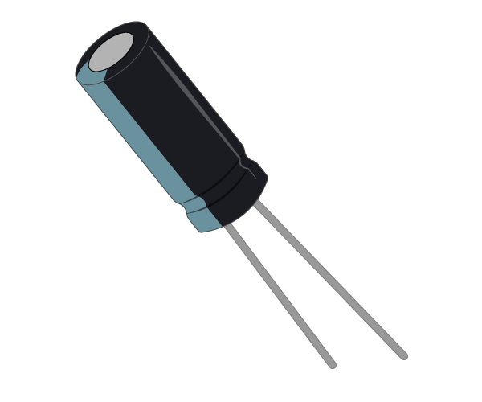

## Using a light-dependent resistor

### Analogue inputs

In the world of electrical engineering, there are two types of input and output (I/O): analogue and digital. Digital I/O is fairly easy to understand; it's either *on* or *off*, *1* or *0*.

When talking about voltages and the Raspberry Pi, any input that is approximately below 1.8V is considered *off* and anything above 1.8V is considered *on*. For output, 0V is off and 3.3V is on.

Analogue I/O is a little trickier. With an analogue input, we can have a range of voltages from 0V up to 3.3V, and the Raspberry Pi is unable to detect exactly what that voltage is.

![A diagram comparing analogue and digital inputs. On the left, a red waveform graph represents analogue inputs, which can vary continuously between 0V and 3.3V. Below the graph, a caption reads, "Analogue inputs could be given a range of voltages, anywhere from 0V up to 3.3V." On the right, a red square wave graph represents digital inputs, which are either on or off. Below the graph, a caption reads, "Digital inputs are either on or off. Any voltage above 1.8V is considered on, and below that is considered off."](images/analogue-digital.jpg)


### Using a capacitor for analogue inputs

Capacitors are electrical components that store charge.



When current is fed into a capacitor, it will begin to store charge. The voltage across the capacitor will start off low, and increase as the charge builds up.

By putting a resistor in series with the capacitor, you can slow the speed at which it charges. With a high resistance, the capacitor will charge slowly, whereas a low resistance will let it charge quickly.

If you time how long it takes the capacitor's voltage to get over 1.8V (or be *on*), you can work out the resistance of the component in series with it.

Many, but not all, capacitors are polarised which means they have a positive and a negative leg. In this case, the negative leg is shorter and should be marked with a '-' symbol.

### Light-dependent resistors

An LDR (sometimes called a photocell) is a special type of resistor.


When light hits the LDR, its resistance is very low, but when it's in the dark its resistance is very high.

By placing a capacitor in series with an LDR, the capacitor will charge at different speeds depending on whether it's light or dark.

### Creating a light-sensing circuit

--- task ---

+  Place an LDR into your breadboard, as shown below:


--- /task ---

--- task ---

+  Now place a capacitor in series with the LDR. As the capacitor is a polar component, you must make sure the positive, long leg is on the same track as the LDR leg.

![A digital illustration of a breadboard connected to a Raspberry Pi GPIO header. The breadboard is white with a grid of holes, labeled with letters along the sides and numbers along the top and bottom. An LDR (light-dependent resistor) is inserted at row 4, columns e and f, and a cylindrical capacitor is inserted at row 4, columns a and b, with its leads extending into the adjacent holes. Below the breadboard, the green Raspberry Pi GPIO header shows various labeled pins for connecting electronic components](images/Laser-tripwire_2-01.jpg)

--- /task ---

--- task ---

+  Finally, add jumper leads to connect the two components to your Raspberry Pi.

![A digital illustration of a breadboard connected to a Raspberry Pi GPIO header. The breadboard is white with a grid of holes, labeled with letters along the sides and numbers along the top and bottom. An LDR (light-dependent resistor) is inserted at row 4, columns e and f, and a cylindrical capacitor is inserted at row 4, columns a and b. Three wires (red, blue, and black) connect the components on the breadboard to the Raspberry Pi GPIO header. The red wire connects to the 3V3 pin, the blue wire to GP4, and the black wire to GND.](images/Laser-tripwire_3-01.jpg)

--- /task ---


### Coding a light sensor

Luckily, most of the complicated code you would have to write to detect the light levels received by the LDR has been abstracted away by the `gpiozero` library. This library will handle the timing of the capacitor's charging and discharging for you.

--- task ---

Use the following code to set up the light sensor:

```python
from gpiozero import LightSensor, Buzzer

ldr = LightSensor(4)  # alter if using a different pin
while True:
    print(ldr.value)

```

--- /task ---

--- task ---

Run this code, then cover the LDR with your hand and watch the value change. Try shining a strong light onto the LDR.

--- /task ---


