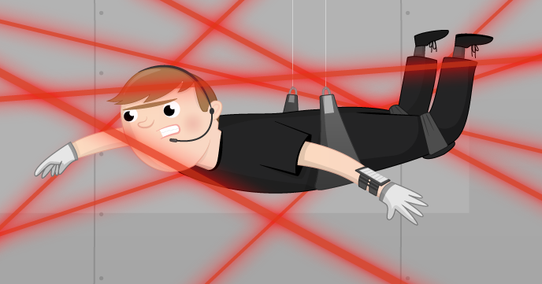

## What next?

You could have your LDR turn on an [LED](https://projects.raspberrypi.org/en/projects/rpi-LED){:target="_blank"}  when it gets dark, or use it to sound a [Buzzer](https://projects.raspberrypi.org/en/projects/rpi-buzzer){:target="_blank"}!

If you are looking for a longer project that uses LDRs, you could try the [Laser Tripwire](https://projects.raspberrypi.org/en/projects/laser-tripwire){:target="_blank"} project. In this project, you will use a laser pointer and a Raspberry Pi to make a laser tripwire. Each time a stealthy intruder breaks the laser beam, the Raspberry Pi will sound the alarm via a buzzer or a speaker!

